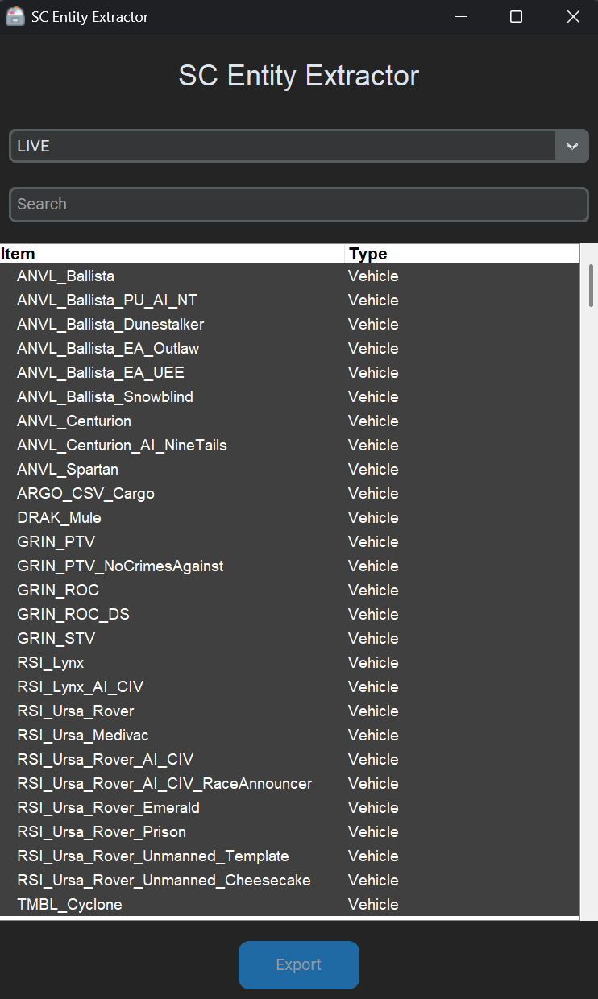

# SC Entity Extractor



⚠️ Cet outil a été testé avec Star Citizen 4.1. Il peut cesser de fonctionner avec les versions futures.

Cet outil dépend de [scdatatools](https://gitlab.com/scmodding/frameworks/scdatatools) et d'une version bêta de [cgf-converter](https://github.com/Markemp/Cryengine-Converter/tree/192/new-ivo-format).

# Installation & Utilisation

1. Téléchargez [SCEntityExtractor.exe](https://github.com/GuillaumeCa/SCEntityExtractor/releases/latest/download/SCEntityExtractor.zip)
2. Téléchargez les outils [texconv](https://github.com/microsoft/DirectXTex/releases) et [cgf-converter](https://github.com/GuillaumeCa/SCEntityExtractor/releases/download/1.0/cgf-converter_beta.zip) dans un dossier de votre choix
3. Ajoutez ce dossier à votre variable d'environnement PATH
4. Lancez SCEntityExtractor.exe
5. Le premier lancement prendra un peu de temps, mais les lancements suivants seront plus rapides grâce à un système de cache (située dans le dossier .sccache)
6. Sélectionnez l'entité que vous souhaitez extraire
7. Cliquez sur "Exporter", cela enregistrera les fichiers exportés dans un dossier nommé `extract`
8. Pour importer le modèle dans Blender vous pouvez installer l'outil [StarFab](https://gitlab.com/scmodding/tools/starfab/-/releases)
9. Une fois l'application StarFab ouverte, fermez la fenêtre qui s'ouvre puis sélectionner l'onglet Blender dans la nouvelle fenêtre qui s'est ouverte.
10. Suivez ensuite cette video pour configurer et installer l'addon: [video d'exemple](https://youtu.be/0YUl951DTQE?t=152). 

Par défaut, l'outil utilisera le chemin `C:/Program Files/Roberts Space Industries/StarCitizen/LIVE` pour le chemin d'installation de Star Citizen, mais vous pouvez le modifier dans le fichier settings.json.

# Compilation

### Prérequis:
- python 3.11 (utiliser pyenv par ex)
- uv (`pip install uv`)

### Compiler l'application à partir des sources
1. Cloner le repository de [scdatatools](https://gitlab.com/scmodding/frameworks/scdatatools) dans un dossier adjacent au projet
2. Executer la commande
```bash
uv pip install ../scdatatools
```
3. Puis executer la commande suivante pour lancer l'application
```bash
uv run main.py
```

4. On peut aussi packager l'application en .exe avec la commande suivante
```bash
uv run pyinstaller -F main.py -n SCEntityExtractor
```
